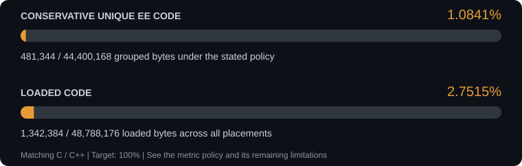
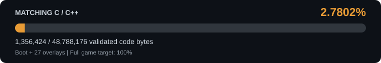

<p align="center">
  
</p>
<p align="center"><strong>Ratchet &amp; Clank: Going Commando</strong></p>

<p align="center">
  <a href="progress/report.json"></a>
  <a href="#prepare-locally"></a>
  <a href="#supported-version"></a>
  <a href="https://github.com/llesieur99/rac2-decomp/actions/workflows/tests.yml"></a>
</p>

<p align="center">
  A work-in-progress, byte-matching decompilation of Going Commando for PlayStation 2.<br>
  Recovering readable C/C++ from the original game, with a native PC port as the long-term goal.
</p>

> [!NOTE]
> This project uses AI-assisted research, coding and tooling under human direction.
> Matching claims require compiler-produced code to pass byte-for-byte comparisons
> against the pinned game executable. An AI-generated answer alone is not evidence.

> [!WARNING]
> This is an early decompilation project, not a playable PC port. No game assets,
> disc images, rebuilt executables or proprietary toolchains are distributed.
> You must supply your own legally obtained copy of the supported release.

## Current status

The global catalogue also reports conservative unique EE code under a
[documented structural grouping policy](docs/GLOBAL-UNIQUE-CODE.md).
Unsupported extents stay separate, unproved address fields stay literal, and
static target classes refine relocation templates. This is a different scope
from loaded-byte coverage; the normal matching acceptance rule is unchanged.



<!-- unique-code-progress:start -->
| Metric | Matched C bytes | Total code bytes | Progress |
| --- | ---: | ---: | ---: |
| Conservative unique EE code (unsupported extents uncollapsed) | 390,028 | 44,400,168 | 0.8784% |
| Loaded code (boot + 27 overlays) | 1,180,752 | 48,788,176 | 2.4202% |

Structurally supported function extents cover 40,075,248 loaded EE bytes; 231,732 EE bytes remain unresolved. VU code excluded: 86,368 bytes.
Provisional representative partition: 37,641,816 bytes (certified: false); no global progress percentage is inferred from this partition.
Conservative global partition retains unknown extents and gaps without deduplication: 8,626,560 loaded EE bytes have unsupported boundaries. The total follows the stated grouping policy and is not a certified original-source size. Supported subset: 390,028 / 35,773,608 unique bytes.

Shared boot binding: 22,576 static edges in combined pinned reference images. Runtime code preservation is unproved. See [the binding and remaining-duplication audit](docs/BOOT-SHARED-CODE-VERIFICATION.md).
<!-- unique-code-progress:end -->

<p align="center">
  <a href="progress/report.json"></a>
</p>

<!-- generated-progress:start -->
Recorded validation on **10 October 2026**:

| Scope | Integrated C functions / placements | Matched C bytes |
| --- | ---: | ---: |
| Boot | 354 functions | 26,268 |
| 27 level overlays | 12,915 placements | 1,154,484 |
| Native overlay subset, included above | 8,519 placements | 914,548 |
| **Total C coverage** | **Boot + all 27 overlays** | **1,180,752 / 48,788,176 (2.4202%)** |
<!-- generated-progress:end -->

The complete boot (**2,521,763 loaded bytes, two PT_LOAD segments**) and all
27 overlays pass loaded-byte and metadata equality gates. Tool tests run in CI.
Assembly reconstruction and naming research are tracked separately from matching C.
Native PC execution and visual gameplay remain unverified; recorded emulator
observations and their limits are in [PCSX2 validation](docs/PCSX2-VALIDATION.md).

Current evidence: [runtime gates](progress/report.json),
[boot integration](progress/integration.json), [level integrations](progress/levels/)
and [independent C qualification](progress/candidates.json).
The progress bar and table are generated together from those validated proofs;
CI rejects either one if stale. Run `python scripts/readme_progress.py` after a validated lot.
Its fill uses the full 0–100% scale.

## Supported version

| Game | Platform | Region | Version | Boot executable |
| --- | --- | --- | --- | --- |
| Ratchet & Clank: Going Commando (2003) | PlayStation 2 | USA / NTSC-U | 1.01 | `SCUS_972.68` |
| Ratchet & Clank 2: Locked and Loaded (2003) | PlayStation 2 | Europe / PAL | 1.00 | `SCES_516.07` |

Matching proofs exist for USA v1.01 only. Disc and boot identities are pinned in
[target configuration](config/target.json); all 27 extracted overlay identities
are in [overlay configuration](config/overlays.json). The PAL release is a
registered but unpinned region: `--region pal` lets the preparation and
reconstruction tools measure and round-trip it, without C catalogues or credit.
See [game regions](docs/REGIONS.md). Greatest Hits v2.00 is a different target.

The functional, non-matching PAL reconstruction and native-port skeleton from
[platypet2217-star/RAC2Decomp](https://github.com/platypet2217-star/RAC2Decomp)
are imported with their history under [ports/pal-functional/](ports/pal-functional/).
They are outside the matching sources and add no progress.

## Start or resume work

### Your first contribution, guided by an AI

**No programming or PS2 experience needed to get started.** Bring a coding AI
that can edit files and run commands, and a GitHub account to submit your work.

> [!IMPORTANT]
> **Bring your own legally acquired USA v1.01 ISO and the complete qualified tool suite.**
> Your AI guides installation and verification. Finish setup before selecting a contribution.

| ① Start your AI | ② Verify your setup | ③ Submit for review |
| :--- | :--- | :--- |
| Copy the request below into your coding assistant. | Let it verify your ISO, tools and baseline, and explain any step that needs you. | Review the change and draft PR. The maintainer reviews it before merging. |

**Your guides:** [Beginner walkthrough](docs/CONTRIBUTOR-QUICKSTART.md) ·
[Tools & official sources](toolchain/README.md) · [Contribution rules](CONTRIBUTING.md)

### Copy this request into your AI

```text
I am a beginner. Help me make one contribution to
https://github.com/llesieur99/rac2-decomp from branch RAC2.
Read AGENTS.md, docs/CONTRIBUTOR-QUICKSTART.md and toolchain/README.md.
Use my fork and a topic branch; I authorize pushing the tested change to my
fork and opening a draft PR to upstream RAC2, not pushing or merging upstream.
Verify my legally acquired matching ISO and complete tool suite first.
If anything is missing, finish setup before selecting a contribution.
Preserve existing work, run the real gates/tests, show the diff, and use
detailed English commits. Never upload private/game/SDK files or invent a match.
```

The walkthrough explains forks, branches and PRs. The tool guide distinguishes
public downloads from locally supplied legacy tools. An AI cannot supply missing
rights or prove matching code without the qualified tools and reference bytes.

<details>
<summary><strong>Already set up? Resume the campaign →</strong></summary>

### Pick up the current task

Open the local checkout on branch **`RAC2`** and read [AGENTS.md](AGENTS.md),
then the [continuation guide](docs/CONTINUE.md). The repository holds the method,
task decisions and proof history. Your ignored `.local/ENVIRONMENT.md` pointer
supplies machine-specific paths and private operational state when available.

Use the [campaign workflow](docs/CAMPAIGN-WORKFLOW.md) to check progress and select a task:

```powershell
python scripts/campaign.py --runtime <private-campaign-directory> status
python scripts/campaign.py --runtime <private-campaign-directory> queue
python scripts/campaign.py --runtime <private-campaign-directory> packet <task-id>
```

[config/campaign-register.json](config/campaign-register.json) is the one task
and experiment authority. The [queue view](docs/CAMPAIGN-QUEUE.md) and
[historical experiment view](docs/C-NATIVE-EXPERIMENT-REGISTER.md) are derived
from it. Prior refusals and reopening conditions remain recorded. Trial sources,
objects, assembly, logs and immutable UUID evidence packages stay private.

The [shared-family workflow](docs/NORMALIZED-FAMILY-WORKFLOW.md) discovers candidate
copies and prepares reviewed canonical C controls with explicit per-level bindings.
It retains constants and uses the existing unmasked exact checks; its discovery
reports and private banks add no matching credit.

</details>

## Requirements

For acquisition links, component roles, versions and hash sources, start with
[toolchain/README.md](toolchain/README.md) and [requirements metadata](toolchain/requirements.json).
The folder hosts documentation only; `toolchain/local/` is ignored by Git.

- Python 3.12 and the pinned dependencies in [requirements.txt](requirements.txt).
- Your own legally acquired matching ISO and a runtime directory outside this repository.
- Wrench `wrenchbuild` for unpacking the level executables.
- Windows and a supplied **SN ProDG 2.0** EE toolchain for assembly reconstruction.
- WSL and the qualified **GNU EE 2.9-ee-991111b** `cpp`/`cc1`/`as` profile for C,
  plus the **SN ProDG 3.01** EE linker.
- Ghidra with verified R5900 support and analysis access for the AI.
- PCSX2 with a usable configuration and your own permitted local PS2 BIOS.

The current C flags are `-O2 -G0 -ffunction-sections`. The original game's compiler
identity is not established by the matching corpus. The earlier SN compiler
profile is historical; see [compiler provenance and measured limits](docs/COMPILER-NOTES.md).
No SDK is supplied or downloaded by these scripts.

## Prepare locally

The [full setup walkthrough](docs/START-HERE.md) explains the reference preparation
and underlying gates. Check the environment first:

```powershell
python scripts/doctor.py
# Install only if required package versions are missing:
python -m pip install -r requirements.txt
python scripts/setup.py --iso <disc.iso> --runtime <private-runtime-directory> --wrench <wrenchbuild.exe>
```

Reuse a configured Python interpreter; a virtual environment is optional for
dependency isolation. Use that same interpreter throughout and preserve other
projects' package requirements when choosing where to install dependencies.

For an archive, replace `--iso` with `--archive <archive.7z> --sevenzip <7z.exe>`.
Preparation verifies the disc and extracts the pinned boot and all 27 overlays.
`<private-runtime-directory>/latest.json` points to the successful manifest.
Keep source, game images, toolchains and generated runtime outputs separate.

For a complete build with reviewed C, use the explicit preparation manifest:

```powershell
python scripts/campaign.py --runtime <private-campaign-directory> integrate -- --manifest <manifest.json> --toolchain <SN-ProDG-2.0-EE-gcc-directory> --c-toolchain <SN-ProDG-3.01-EE-gcc-directory> --program-jobs 4 --jobs 2
```

This runs fresh boot and 27-overlay gates with bounded parallelism. It produces
private evidence; it does not publish proofs or push Git automatically. Review
and publish the coherent proof set using the [campaign procedure](docs/CAMPAIGN-WORKFLOW.md).

## Source organization and matching rules

Author under [src/boot/](src/boot/) and [src/levels/](src/levels/).
[Source recipes](config/source-layout.json) assemble the standalone compilation
units in [candidates/](candidates/), preserving declaration context and explicit
per-program placements. The organization pilot regenerates all 28 units
byte-identically. Module boundaries describe authored organization, not recovered
original object files. Follow [source authoring and regeneration](docs/SOURCE-LAYOUT.md).

```powershell
python scripts/source_layout.py --check --inventory-check progress/source-inventory.json
python -m unittest discover -s tests
python scripts/readme_progress.py --check
```

The [authored-source inventory](progress/source-inventory.json) counts source
families and textual variants separately from replicated code coverage. Its
representative byte counts do not add to the game's matching numerator.

Every accepted body requires a fresh compiler-produced object, a defined function
at the reviewed address, its complete symbol size and all matching bytes. The
same object must pass the complete image gate before integration credit is given.
Padding and remaining assembly stay in the reconstruction. Prefix matches,
relocation-masked acceptance, patched bytes and guessed ABI returns are insufficient.
Keep every source, catalog, tool and proof dependency coherent after an edit.

## Progress reporting and research

CI exports **`SCUS_972.68_report`** in objdiff report v2 format from the boot and
all 27 level integration proofs. This independently validates the current
integrated C total, source/catalog hashes, object provenance and non-overlapping ranges.
Generated section units are remaining work, not completed C translation units.
CI also publishes the separate authored-source inventory.

Dispatch-table and diagnostic-message research helps identify functions, but
labels alone add no matching credit. Methods and provenance are documented in
[dispatch tables](docs/MOBY-DISPATCH-TABLES.md) and
[assert-message annotations](docs/ASSERT-MESSAGE-NAMES.md).

Latest matching work and its negative measurements remain in the lot documents:

| Lot | Result |
| --- | --- |
| [25](docs/TWENTY-FIFTH-C-LOT.md) | Two native families and five Ship Shack bodies; 1,008 added C bytes |
| [26](docs/TWENTY-SIXTH-C-LOT.md) | Quadratic family and seven Ship Shack bodies; 1,120 added C bytes |
| [27](docs/TWENTY-SEVENTH-C-LOT.md) | Three native families and two Ship Shack call sequences; 5,288 added C bytes |

The later source/workflow organization and README bar add no matching credit.
The next targets and parked experiments are selected through the current register.

## Community and contributions

Related projects include [RAC1](https://github.com/Lynder063/rac1-decomp) and
[UYA](https://github.com/vetusmagnus/ratchet-uya-decomp). Shared engine research
can inform a hypothesis; addresses and code must be verified against the RAC2 target.
Reused C is credited per function in [the second C lot](docs/SECOND-C-LOT.md),
and contributed research in [community engine references](docs/COMMUNITY-ENGINE-REFERENCE.md).
Compiler, libgcc and SDK findings measured on RAC1 are summarised in
[findings from rac1-decomp](docs/RAC1-DECOMP-FINDINGS.md).
[OpenRAC](https://openrac.dev/) provides a community view of decompilation projects.

Read [CONTRIBUTING.md](CONTRIBUTING.md) before contributing. Write documentation,
comments and commits in English; use a scoped subject and substantive commit body.
Keep contributions coherent, validate affected proofs and retain negative evidence.
Game data, extracted retail assembly and proprietary tools remain outside Git.

## Reusable code families

The [supplementary reuse report](progress/code-reuse-report.json) measures
complete instruction templates with explicit per-image address bindings. Its
[family catalogue](progress/code-reuse-families.json.gz) lists the proved copies
and independently validated authored C fragment reuse; the summary exposes
uncertain boundary and residual totals.
This measure keeps its own all-placement C numerator and preserves the existing
conservative and physical progress measures. It does not establish a 5 MB
original-source total. See [the proof scope and measured baseline](docs/GLOBAL-CODE-REUSE.md).

## Next milestones

The [bounded local GP verifier](docs/LOCAL-GP-PROOF.md) starts from unknown
entry registers and admits only closed direct CFGs. Its
[historical 28-body pilot receipt](progress/gp-local-pilot.json) preserves the
superseded observations and current refusals without adding GP16 normalization
or matching C credit.

1. Expand matching C while keeping the boot and all affected overlay gates exact.
2. Review new function boundaries and ABI, qualify complete units and publish tested lots.
3. Extend verified shared families and readable source organization.
4. Reach complete matching decompilation, then develop and validate the native runtime and launcher.

Intermediate percentages are milestones, not completion of the project.

## Licence

MIT — see [LICENSE](LICENSE). It covers the repository's code, never the game,
its assets or proprietary toolchains. Contributions use the same terms.
`ports/pal-functional/` keeps its own MIT notice, copyright platypet2217-star,
in [its LICENSE](ports/pal-functional/LICENSE).
